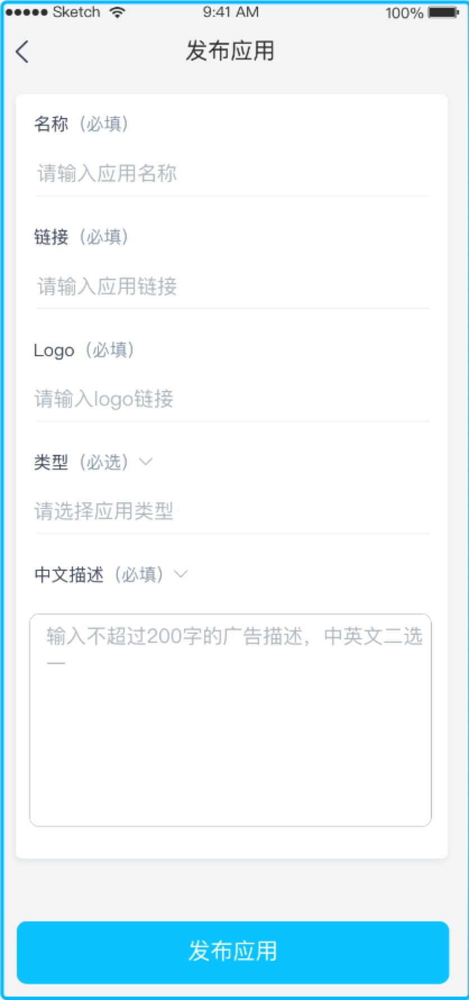
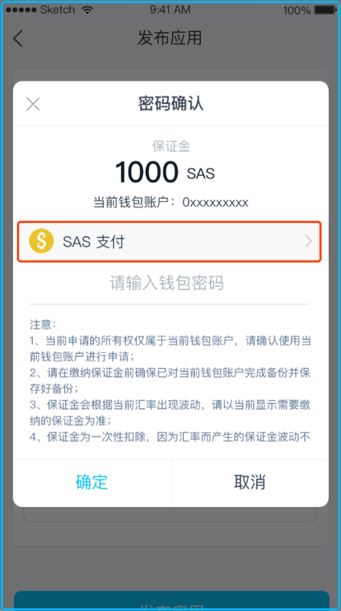
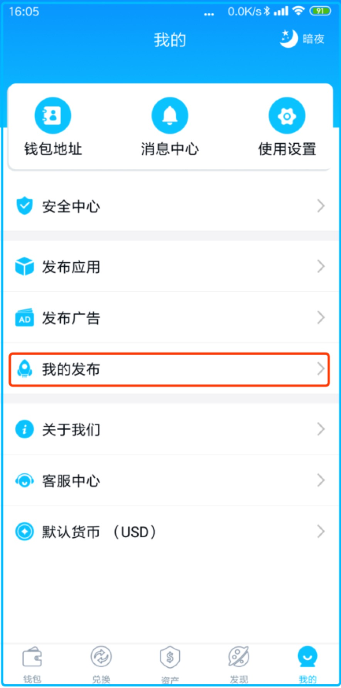

## 基于 SAS 公链开发 DAPP 教程
SAS 公链为了让全球的开发者更容易上手，在技术实现上完全兼容以太坊，包括智能合约的开发和部署，SAS 的友好兼容性包括兼容以太坊的开发工具，如 Remix、Web3.js等。这种友好的兼容性是为了让以太坊的开发者零成本的迁移到 SAS 公链平台。

### 1. 在 SAS 公链上部署智能合约
* 在 MetaMask 上设置 SAS 主网节点信息
* 在 Remix 上进行编译和部署智能合约
开发文档参考官方文档 [SAS github.com](https://github.com/sasassistant/sas)

### 2. 在 SCAP 上发布 DAPP
* 先下载 SCAP 并创建账户 [下载地址](https://www.facelesss.com/topic/194)
* 在 "我的" -> "发布广告"

 
* 在发布应用页面填写发布内容

 
* 填写完成后会生成账单

 
* 也可以选择不同的币种进行支付

 
* 支付完成后等待客户审核，审核进度可以在 "我的" -> "我的发布" 中进行查看

 
* 审核成功后在 "发现" -> "DAPP" 页面出现对应的 DAPP

 
